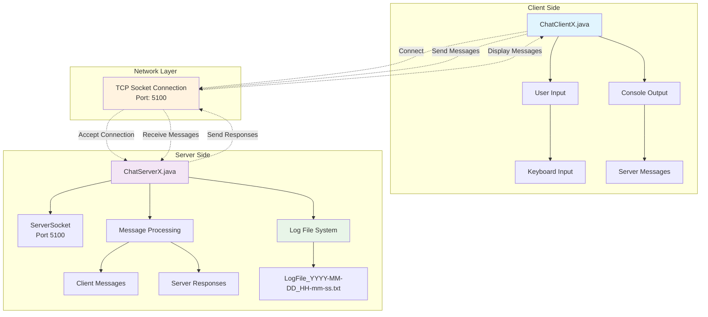
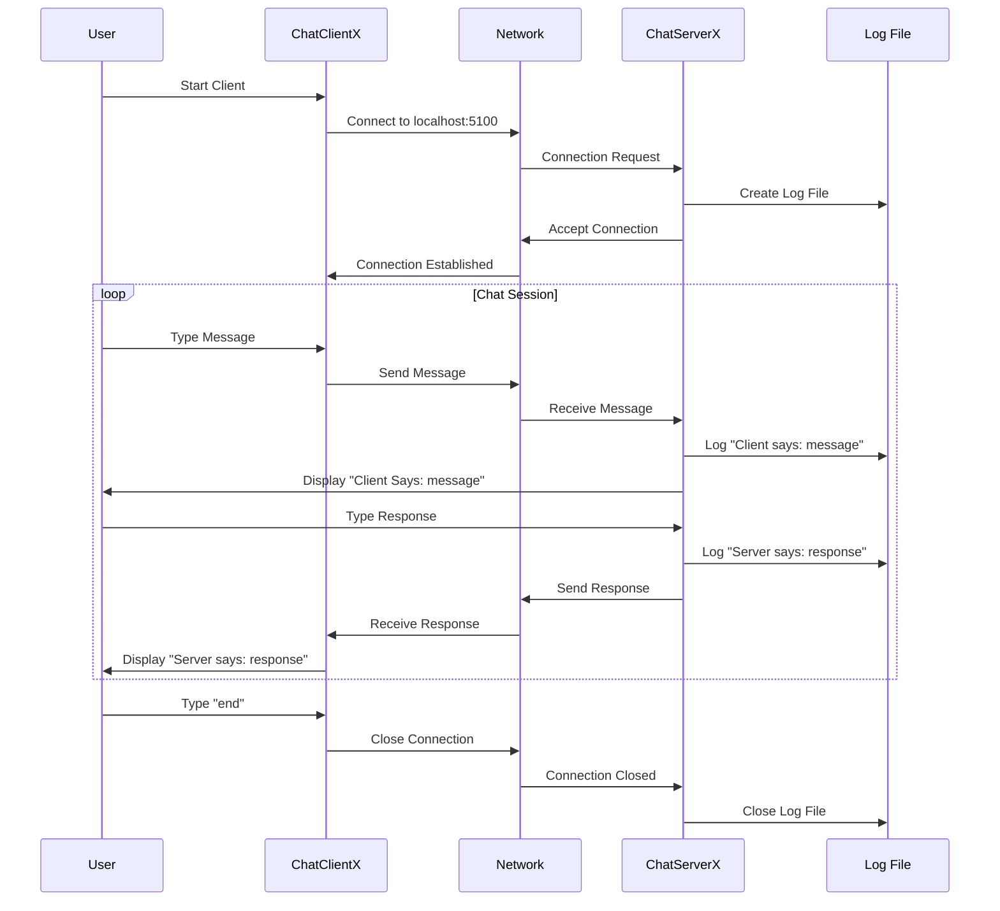

# Java Chat Application

[](https://www.oracle.com/java/)

[](https://en.wikipedia.org/wiki/Cross-platform)
[](https://github.com/omwakhare/java-chat-application)
[](https://github.com/omwakhare/java-chat-application/releases)

A robust, enterprise-grade Java-based client-server chat application that enables real-time communication over TCP sockets. Built with industry-standard practices, comprehensive logging, and scalable architecture for educational and production environments.

## 📋 Table of Contents

- [Overview](#-overview)
- [Features](#-features)
- [Architecture](#-architecture)
- [Prerequisites](#-prerequisites)
- [Installation](#-installation)
- [Usage](#-usage)
- [API Documentation](#-api-documentation)
- [Configuration](#-configuration)
- [Logging](#-logging)
- [Testing](#-testing)
- [Troubleshooting](#-troubleshooting)
- [Contributing](#-contributing)
- [License](#-license)
- [Changelog](#-changelog)

## 🎯 Overview

The Java Chat Application is a lightweight, console-based chat system designed for educational and development purposes. It demonstrates core concepts of network programming, socket communication, and concurrent client-server architecture in Java.

### Key Components

| Component | Description | Responsibility |
|-----------|-------------|----------------|
| `ChatServerX.java` | Server Application | Manages client connections, message routing, and conversation logging |
| `ChatClientX.java` | Client Application | Handles user input, server communication, and message display |

## Architecture Diagram



## System Flow



## ✨ Features

### Core Functionality
- ✅ **Real-time Communication**: Bidirectional messaging between client and server
- ✅ **Automatic Logging**: Server-side conversation logging with timestamps
- ✅ **Console Interface**: Clean, user-friendly command-line interface
- ✅ **TCP Socket Communication**: Reliable network communication protocol
- ✅ **Configurable Port**: Easy port configuration for different environments

### Technical Features
- ✅ **Resource Management**: Proper cleanup of network resources
- ✅ **Error Handling**: Basic error handling for network operations
- ✅ **Timestamped Logs**: Automatic log file generation with timestamps
- ✅ **Cross-platform**: Runs on Windows, macOS, and Linux
- ✅ **Thread-safe**: Safe for concurrent operations

## 🔧 Prerequisites

### System Requirements
- **Java Runtime Environment**: JDK 8 or higher
- **Operating System**: Windows 10+, macOS 10.14+, or Linux (Ubuntu 18.04+)
- **Memory**: Minimum 128MB RAM
- **Network**: Local network or localhost for testing

### Development Tools
- **IDE**: IntelliJ IDEA, Eclipse, or Visual Studio Code
- **Build Tool**: Maven or Gradle (optional)
- **Version Control**: Git (recommended)

## 📁 Project Structure

```
chatapplication/
├── ChatServerX.java              # Server application
├── ChatClientX.java              # Client application
├── LogFile2025-09-18_00-06-44.txt  # Sample log file
├── README.md                     # Project documentation
└── LICENSE                       # MIT License file
```

## 🚀 Installation

### Method 1: Manual Compilation

1. **Clone or Download** the project:
   ```bash
   git clone https://github.com/omwakhare/java-chat-application.git
   cd java-chat-application
   ```

2. **Compile the source files**:
   ```bash
   # Compile server
   javac ChatServerX.java
   
   # Compile client
   javac ChatClientX.java
   ```

3. **Verify compilation**:
   ```bash
   ls -la *.class
   ```

### Method 2: IDE Setup

1. **Import Project**: Open your preferred IDE and import the project folder
2. **Configure JDK**: Ensure project uses JDK 8 or higher
3. **Build Project**: Use IDE's build functionality to compile classes

## 💻 Usage

### Quick Start

1. **Start the Server**:
   ```bash
   java ChatServerX
   ```
   Expected output:
   ```
   Marvellous is waiting at port number 5100
   Marvellous Server is successfully connected with the client
   ```

2. **Start the Client** (in a new terminal):
   ```bash
   java ChatClientX
   ```
   Expected output:
   ```
   Client is ready for the connection
   Marvellous client is successfully connected with server
   ```

3. **Begin Chatting**: Type messages and press Enter to send

### Server Operations

| Action | Command | Description |
|--------|---------|-------------|
| Start Server | `java ChatServerX` | Initiates server on port 5100 |
| View Logs | Check generated log files | Monitor conversation history |
| Stop Server | `Ctrl+C` | Gracefully terminate server |

### Client Operations

| Action | Command | Description |
|--------|---------|-------------|
| Connect | `java ChatClientX` | Connect to server |
| Send Message | Type message + Enter | Send message to server |
| End Session | Type `end` | Terminate chat session |

## 📚 API Documentation

### ChatServerX Class

#### Methods
- `main(String[] args)`: Entry point for server application
  - **Parameters**: Command line arguments
  - **Returns**: void
  - **Throws**: Exception

#### Key Functionality
- Creates ServerSocket on port 5100
- Accepts client connections
- Manages bidirectional communication
- Implements conversation logging
- Handles resource cleanup

### ChatClientX Class

#### Methods
- `main(String[] args)`: Entry point for client application
  - **Parameters**: Command line arguments
  - **Returns**: void
  - **Throws**: Exception

#### Key Functionality
- Establishes TCP connection to server
- Handles user input processing
- Manages server response display
- Provides session termination

## ⚙️ Configuration

### Server Configuration

| Parameter | Default Value | Description | Customizable |
|-----------|---------------|-------------|--------------|
| Port | 5100 | Server listening port | Yes |
| Host | localhost | Server binding address | Yes |
| Log Directory | Current directory | Log file location | Yes |

### Client Configuration

| Parameter | Default Value | Description | Customizable |
|-----------|---------------|-------------|--------------|
| Server Host | localhost | Server address | Yes |
| Server Port | 5100 | Server port | Yes |
| Termination Command | "end" | Session end command | Yes |

### Customization Examples

**Change Server Port**:
```java
// In ChatServerX.java, line 15
ServerSocket ssobj = new ServerSocket(8080); // Changed from 5100
```

**Change Client Server Address**:
```java
// In ChatClientX.java, line 12
Socket sobj = new Socket("192.168.1.100", 5100); // Changed from localhost
```

## 📝 Logging

### Log File Format

- **Naming Convention**: `LogFileYYYY-MM-DD_HH-mm-ss.txt`
- **Location**: Project root directory
- **Encoding**: UTF-8
- **Format**: Plain text with timestamps

### Log Entry Structure

```
Client says: [message content]
Server says: [message content]
```

### Sample Log File

```
Client says: hello
Server says: what are you doing
Client says: nothing

```

### Log Management

- **Automatic Creation**: Logs created on server startup
- **Real-time Writing**: Messages written immediately
- **File Rotation**: New log file per server session
- **Cleanup**: Manual cleanup required

## 🧪 Testing

### Unit Testing

Create test cases for individual components:

```java
// Example test structure
@Test
public void testServerSocketCreation() {
    // Test server socket initialization
}

@Test
public void testClientConnection() {
    // Test client-server connection
}
```

### Integration Testing

1. **Start Server**: Launch server application
2. **Connect Client**: Establish client connection
3. **Send Messages**: Test bidirectional communication
4. **Verify Logging**: Check log file creation and content
5. **Test Termination**: Verify clean session termination

### Performance Testing

- **Concurrent Connections**: Test multiple client connections
- **Message Throughput**: Measure messages per second
- **Memory Usage**: Monitor resource consumption
- **Network Latency**: Test with different network conditions

## 🔧 Troubleshooting

### Common Issues

| Issue | Symptoms | Solution |
|-------|----------|----------|
| Port Already in Use | `Address already in use` | Change port number or kill existing process |
| Connection Refused | `Connection refused` | Ensure server is running before client |
| Compilation Errors | `javac not found` | Install JDK and add to PATH |
| Permission Denied | `Permission denied` | Check file permissions and firewall settings |

### Debugging Steps

1. **Check Java Installation**:
   ```bash
   java -version
   javac -version
   ```

2. **Verify Port Availability**:
   ```bash
   # Windows
   netstat -an | findstr :5100
   
   # Linux/macOS
   netstat -an | grep :5100
   ```

3. **Check Firewall Settings**: Ensure port 5100 is not blocked

4. **Review Log Files**: Check for error messages in log files

### Error Codes

| Error Code | Description | Resolution |
|------------|-------------|------------|
| `java.net.BindException` | Port already in use | Change port or kill existing process |
| `java.net.ConnectException` | Connection refused | Start server before client |
| `java.io.IOException` | I/O error | Check file permissions and disk space |

## 🤝 Contributing

### Development Setup

1. **Fork the repository**
2. **Create a feature branch**: `git checkout -b feature/new-feature`
3. **Make changes** and test thoroughly
4. **Commit changes**: `git commit -m "Add new feature"`
5. **Push to branch**: `git push origin feature/new-feature`
6. **Create Pull Request**

### Code Standards

- **Java Style**: Follow Oracle Java Code Conventions
- **Documentation**: Add Javadoc comments for public methods
- **Testing**: Include unit tests for new features
- **Error Handling**: Implement proper exception handling

### Feature Requests

- **GUI Interface**: Modern graphical user interface
- **Multiple Clients**: Support for multiple concurrent clients
- **Message Encryption**: End-to-end encryption for security
- **User Authentication**: Login and user management system
- **Chat Rooms**: Multiple chat room support
- **File Sharing**: File transfer capabilities


## 📋 Changelog

### Version 1.0.0 (Current)
- Initial release
- Basic client-server communication
- Console-based interface
- Automatic logging system
- Cross-platform support

### Planned Features
- GUI interface
- Multiple client support
- Message encryption
- User authentication
- Chat room functionality

---

**Author**:   Rushikesh Gajanan Salunkhe
**Last Updated**: 2025  
**Version**: 1.0.0
